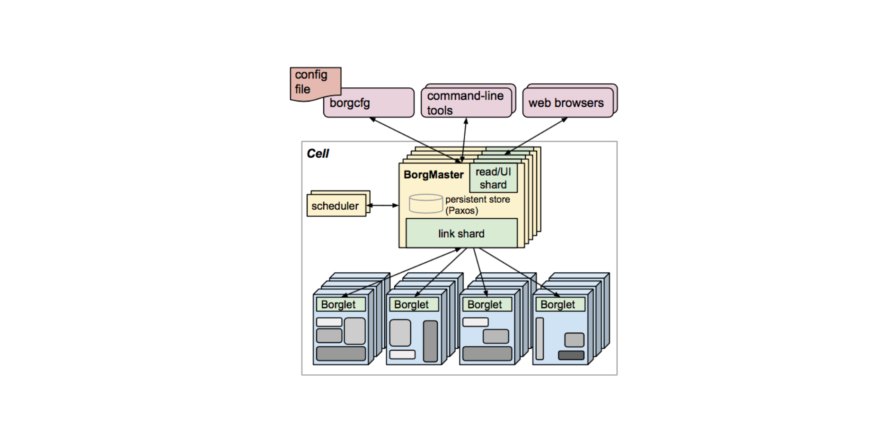
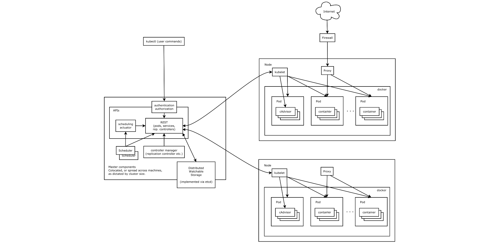
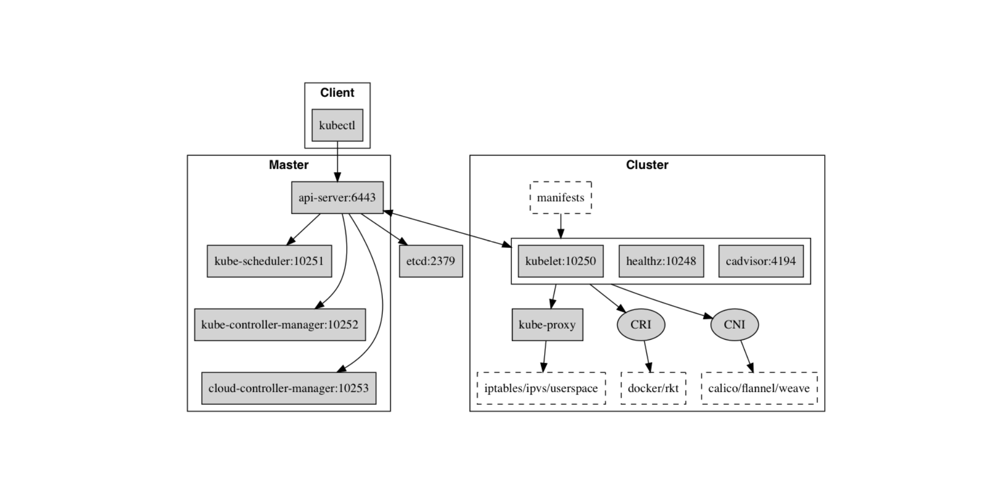

<!-- toc -->

tag: kubernetes framwork

# Borg 简介
> Borg 是谷歌内部的大规模集群管理系统，负责对谷歌内部很多核心服务的调度和管理。Borg 的目的是让用户能够不必操心资源管理的问题，让他们专注于自己的核心业务，并且做到跨多个数据中心的资源利用率最大化。   
> Borg 主要由 BorgMaster、Borglet、borgcfg 和 Scheduler 组成，如下图所示   

> > 1、BorgMaster 是整个集群的大脑，负责维护整个集群的状态，并将数据持久化到 Paxos 存储中；   
> > 2、Scheduer 负责任务的调度，根据应用的特点将其调度到具体的机器上去；   
> > 3、Borglet 负责真正运行任务（在容器中）；   
> > 4、borgcfg 是 Borg 的命令行工具，用于跟 Borg 系统交互，一般通过一个配置文件来提交任务。   

# Kubernetes 架构
> Kubernetes 借鉴了 Borg 的设计理念，比如 Pod、Service、Labels 和单 Pod 单 IP 等。Kubernetes 的整体架构跟 Borg 非常像，如下图所示   

> Kubernetes 主要由以下几个核心组件组成：   
> > 1、etcd 保存了整个集群的状态；   
> > 2、kube-apiserver 提供了资源操作的唯一入口，并提供认证、授权、访问控制、API 注册和发现等机制；   
> > 3、kube-controller-manager 负责维护集群的状态，比如故障检测、自动扩展、滚动更新等；   
> > 4、kube-scheduler 负责资源的调度，按照预定的调度策略将 Pod 调度到相应的机器上；   
> > 5、kubelet 负责维持容器的生命周期，同时也负责 Volume（CVI）和网络（CNI）的管理；   
> > 6、Container runtime 负责镜像管理以及 Pod 和容器的真正运行（CRI），默认的容器运行时为 Docker；   
> > 7、kube-proxy 负责为 Service 提供 cluster 内部的服务发现和负载均衡；   
   
> >
>  除了核心组件，还有一些推荐的 Add-ons：   
> > 1、coredns(kube-dns)负责为整个集群提供 DNS 服务   
> > 2、Ingress Controller 为服务提供外网入口   
> > 3、metrics-server(heapster) 提供资源监控
> > 4、Dashboard 提供 GUI   
> > 5、Federation 提供跨可用区的集群   
> > 6、Fluentd-elasticsearch 提供集群日志采集、存储与查询

# Kubernetes 架构示意图
> 整体架构   
> > 下图清晰表明了Kubernetes的架构设计以及组件之间的通信协议。   

>> 
> Master架构
>> 下图展示的是master节点核心组件   
   
>>
> Node架构
>> 下图展示的是node节点核心组件   

>>
> 分层架构   
>> Kubernetes设计理念和功能其实就是一个类似Linux的分层架构，如下图所示。   

>> 1. 核心层：Kubernetes最核心的功能，对外提供API构建高层的应用，对内提供插件式应用执行环境   
>> 2. 应用层：部署（无状态应用、有状态应用、批处理任务、集群应用等）和路由（服务发现、DNS解析等）、Service Mesh（部分位于应用层）   
>> 3. 管理层：系统度量（如基础设施、容器和网络的度量），自动化（如自动扩展、动态Provision等）以及策略管理（RBAC、Quota、PSP、NetworkPolicy等）、Service Mesh（部分位于管理层）   
>> 4. 接口层：kubectl命令行工具、客户端SDK以及集群联邦   
>> 5. 生态系统：在接口层之上的庞大容器集群管理调度的生态系统，可以划分为两个范畴   
>>> 1. Kubernetes外部：日志、监控、配置管理、CI/CD、Workflow、FaaS、OTS应用、ChatOps、GitOps、SecOps等   
>>> 2. Kubernetes内部：CRI、CNI、CSI、镜像仓库、Cloud Provider、集群自身的配置和管理等   

