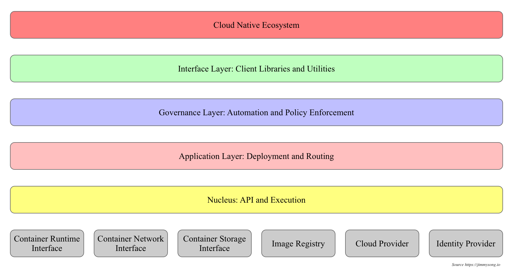

# Kubernetes设计理念与分布式系统
> 分析和理解Kubernetes的设计理念可以使我们更深入地了解Kubernetes系统，更好地利用它管理分布式部署的云原生应用，另一方面也可以让我们借鉴其在分布式系统设计方面的经验。   

## 分层架构
> Kubernetes设计理念和功能其实就是一个类似Linux的分层架构，如下图所示。   

> 1. 核心层：Kubernetes最核心的功能，对外提供API构建高层的应用，对内提供插件式应用执行环境   
> 2. 应用层：部署（无状态应用、有状态应用、批处理任务、集群应用等）和路由（服务发现、DNS解析等）、Service Mesh（部分位于应用层）   
> 3. 管理层：系统度量（如基础设施、容器和网络的度量），自动化（如自动扩展、动态Provision等）以及策略管理（RBAC、Quota、PSP、NetworkPolicy等）、Service Mesh（部分位于管理层）   
> 4. 接口层：kubectl命令行工具、客户端SDK以及集群联邦   
> 5. 生态系统：在接口层之上的庞大容器集群管理调度的生态系统，可以划分为两个范畴   
>> 1. Kubernetes外部：日志、监控、配置管理、CI/CD、Workflow、FaaS、OTS应用、ChatOps、GitOps、SecOps等   
>> 2. Kubernetes内部：CRI、CNI、CSI、镜像仓库、Cloud Provider、集群自身的配置和管理等   

## API设计原则
> 对于云计算系统，系统API实际上处于系统设计的统领地位，正如本文前面所说，Kubernetes集群系统每支持一项新功能，引入一项新技术，一定会新引入对应的API对象，支持对该功能的管理操作，理解掌握的API，就好比抓住了Kubernetes系统的牛鼻子。Kubernetes系统API的设计有以下几条原则：   
>> 1. **所有API应该是声明式的**。正如前文所说，声明式的操作，相对于命令式操作，对于重复操作的效果是稳定的，这对于容易出现数据丢失或重复的分布式环境来说是很重要的。另外，声明式操作更容易被用户使用，可以使系统向用户隐藏实现的细节，隐藏实现的细节的同时，也就保留了系统未来持续优化的可能性。此外，声明式的API，同时隐含了所有的API对象都是名词性质的，例如Service、Volume这些API都是名词，这些名词描述了用户所期望得到的一个目标分布式对象。   
>> 2. 

