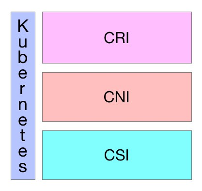

# 开放接口
> Kubernetes作为云原生应用的基础调度平台，相当于云原生的操作系统，为了便于系统的扩展，Kubernetes中开放的以下接口，可以分别对接不同的后端，来实现自己的业务逻辑：   
> > 1. CRI（Container Runtime Interface）：容器运行时接口，提供计算资源   
> > 2. CNI（Container Network Interface）：容器网络接口，提供网络资源   
> > 3. CSI（Container Storage Interface）：容器存储接口，提供存储资源   
> 
> 以上三种资源相当于一个分布式操作系统的最基础的几种资源类型，而Kuberentes是将他们粘合在一起的纽带。   


## CRI - Container Runtime Interface（容器运行时接口）
> CRI中定义了容器和镜像的服务的接口，因为容器运行时与镜像的生命周期是彼此隔离的，因此需要定义两个服务。该接口使用[Protocol Buffer](https://developers.google.com/protocol-buffers/)，基于[gRPC](https://grpc.io/)，在Kubernetes v1.10+版本中是在[pkg/kubelet/apis/cri/runtime/v1alpha2](https://github.com/kubernetes/kubernetes/tree/master/pkg/kubelet/apis/cri/runtime/v1alpha2)的api.proto中定义的。   

### CRI架构
> Container Runtime实现了CRI gRPC Server，包括RuntimeService和ImageService。该gRPC Server需要监听本地的Unix socket，而kubelet则作为gRPC Client运行。   


### 启用CRI
> 1. 除非集成了rktnetes，否则CRI都是被默认启用了，从Kubernetes1.7版本开始，旧的预集成的docker CRI已经被移除。   
> 2. 要想启用CRI只需要在kubelet的启动参数重传入此参数：--container-runtime-endpoint远程运行时服务的端点。当前Linux上支持unix socket，windows上支持tcp。例如：unix:///var/run/dockershim.sock、 tcp://localhost:373，默认是unix:///var/run/dockershim.sock，即默认使用本地的docker作为容器运行时。   
> 3. 关于CRI的详细进展请参考[CRI: the Container Runtime Interface](https://github.com/kubernetes/community/blob/master/contributors/devel/container-runtime-interface.md)。

### CRI接口
> Kubernetes 1.9中的CRI接口在api.proto中的定义如下：
```bash
// Runtime service defines the public APIs for remote container runtimes
service RuntimeService {
    // Version returns the runtime name, runtime version, and runtime API version.
    rpc Version(VersionRequest) returns (VersionResponse) {}

    // RunPodSandbox creates and starts a pod-level sandbox. Runtimes must ensure
    // the sandbox is in the ready state on success.
    rpc RunPodSandbox(RunPodSandboxRequest) returns (RunPodSandboxResponse) {}
    // StopPodSandbox stops any running process that is part of the sandbox and
    // reclaims network resources (e.g., IP addresses) allocated to the sandbox.
    // If there are any running containers in the sandbox, they must be forcibly
    // terminated.
    // This call is idempotent, and must not return an error if all relevant
    // resources have already been reclaimed. kubelet will call StopPodSandbox
    // at least once before calling RemovePodSandbox. It will also attempt to
    // reclaim resources eagerly, as soon as a sandbox is not needed. Hence,
    // multiple StopPodSandbox calls are expected.
    rpc StopPodSandbox(StopPodSandboxRequest) returns (StopPodSandboxResponse) {}
    // RemovePodSandbox removes the sandbox. If there are any running containers
    // in the sandbox, they must be forcibly terminated and removed.
    // This call is idempotent, and must not return an error if the sandbox has
    // already been removed.
    rpc RemovePodSandbox(RemovePodSandboxRequest) returns (RemovePodSandboxResponse) {}
    // PodSandboxStatus returns the status of the PodSandbox. If the PodSandbox is not
    // present, returns an error.
    rpc PodSandboxStatus(PodSandboxStatusRequest) returns (PodSandboxStatusResponse) {}
    // ListPodSandbox returns a list of PodSandboxes.
    rpc ListPodSandbox(ListPodSandboxRequest) returns (ListPodSandboxResponse) {}

    // CreateContainer creates a new container in specified PodSandbox
    rpc CreateContainer(CreateContainerRequest) returns (CreateContainerResponse) {}
    // StartContainer starts the container.
    rpc StartContainer(StartContainerRequest) returns (StartContainerResponse) {}
    // StopContainer stops a running container with a grace period (i.e., timeout).
    // This call is idempotent, and must not return an error if the container has
    // already been stopped.
    // TODO: what must the runtime do after the grace period is reached?
    rpc StopContainer(StopContainerRequest) returns (StopContainerResponse) {}
    // RemoveContainer removes the container. If the container is running, the
    // container must be forcibly removed.
    // This call is idempotent, and must not return an error if the container has
    // already been removed.
    rpc RemoveContainer(RemoveContainerRequest) returns (RemoveContainerResponse) {}
    // ListContainers lists all containers by filters.
    rpc ListContainers(ListContainersRequest) returns (ListContainersResponse) {}
    // ContainerStatus returns status of the container. If the container is not
    // present, returns an error.
    rpc ContainerStatus(ContainerStatusRequest) returns (ContainerStatusResponse) {}
    // UpdateContainerResources updates ContainerConfig of the container.
    rpc UpdateContainerResources(UpdateContainerResourcesRequest) returns (UpdateContainerResourcesResponse) {}

    // ExecSync runs a command in a container synchronously.
    rpc ExecSync(ExecSyncRequest) returns (ExecSyncResponse) {}
    // Exec prepares a streaming endpoint to execute a command in the container.
    rpc Exec(ExecRequest) returns (ExecResponse) {}
    // Attach prepares a streaming endpoint to attach to a running container.
    rpc Attach(AttachRequest) returns (AttachResponse) {}
    // PortForward prepares a streaming endpoint to forward ports from a PodSandbox.
    rpc PortForward(PortForwardRequest) returns (PortForwardResponse) {}

    // ContainerStats returns stats of the container. If the container does not
    // exist, the call returns an error.
    rpc ContainerStats(ContainerStatsRequest) returns (ContainerStatsResponse) {}
    // ListContainerStats returns stats of all running containers.
    rpc ListContainerStats(ListContainerStatsRequest) returns (ListContainerStatsResponse) {}

    // UpdateRuntimeConfig updates the runtime configuration based on the given request.
    rpc UpdateRuntimeConfig(UpdateRuntimeConfigRequest) returns (UpdateRuntimeConfigResponse) {}

    // Status returns the status of the runtime.
    rpc Status(StatusRequest) returns (StatusResponse) {}
}

// ImageService defines the public APIs for managing images.
service ImageService {
    // ListImages lists existing images.
    rpc ListImages(ListImagesRequest) returns (ListImagesResponse) {}
    // ImageStatus returns the status of the image. If the image is not
    // present, returns a response with ImageStatusResponse.Image set to
    // nil.
    rpc ImageStatus(ImageStatusRequest) returns (ImageStatusResponse) {}
    // PullImage pulls an image with authentication config.
    rpc PullImage(PullImageRequest) returns (PullImageResponse) {}
    // RemoveImage removes the image.
    // This call is idempotent, and must not return an error if the image has
    // already been removed.
    rpc RemoveImage(RemoveImageRequest) returns (RemoveImageResponse) {}
    // ImageFSInfo returns information of the filesystem that is used to store images.
    rpc ImageFsInfo(ImageFsInfoRequest) returns (ImageFsInfoResponse) {}
}
```
> 这其中包含了两个gRPC服务：
> > 1. RuntimeService：容器和Sandbox运行时管理。   
> > 2. ImageService：提供了从镜像仓库拉取、查看、和移除镜像的RPC。   

### 当前支持的CRI后端
> 我们最初在使用Kubernetes时通常会默认使用Docker作为容器运行时，其实从Kubernetes 1.5开始已经开始支持CRI，目前是处于Alpha版本，通过CRI接口可以指定使用其它容器运行时作为Pod的后端，目前支持 CRI 的后端有：   
> > 1. [cri-o](https://github.com/kubernetes-sigs/cri-o)：同时兼容OCI和CRI的容器运行时   
> > 2. [cri-containerd](https://github.com/containerd/cri)：基于Containerd的Kubernetes CRI 实现   
> > 3. [rkt](https://coreos.com/rkt/)：由于CoreOS主推的用来跟docker抗衡的容器运行时   
> > 4. [frakti](https://github.com/kubernetes/frakti)：基于hypervisor的CRI   
> > 5. [docker](https://www.docker.com/)：kuberentes最初就开始支持的容器运行时，目前还没完全从kubelet中解耦，docker公司同时推广了OCI标准   
> > 6. [Clear Containers](https://github.com/clearcontainers)：由Intel推出的同时兼容OCI和CRI的容器运行时   
> > 7. [Kata Containers](https://katacontainers.io/)：符合OCI规范同时兼容CRI   
> > 8. [gVisor](https://github.com/google/gvisor)：由谷歌推出的容器运行时沙箱(Experimental)   

### 参考
> [docker containerd runc你应该知道的所有](https://www.infoq.cn/article/2017%2F02%2FDocker-Containerd-RunC)

## CNI - Container Network Interface（容器网络接口）
> 1. CNI（Container Network Interface）是CNCF旗下的一个项目，由一组用于配置Linux容器的网络接口的规范和库组成，同时还包含了一些插件。CNI仅关心容器创建时的网络分配，和当容器被删除时释放网络资源。通过此链接浏览该项目：[https://github.com/containernetworking/cni](https://github.com/containernetworking/cni)。   
> 2. Kubernetes源码的vendor/github.com/containernetworking/cni/libcni目录中已经包含了CNI的代码，也就是说kubernetes中已经内置了CNI。   

### 接口定义
> CNI的接口中包括以下几个方法：   
```bash
type CNI interface {
    AddNetworkList(net *NetworkConfigList, rt *RuntimeConf) (types.Result, error)
    DelNetworkList(net *NetworkConfigList, rt *RuntimeConf) error

    AddNetwork(net *NetworkConfig, rt *RuntimeConf) (types.Result, error)
    DelNetwork(net *NetworkConfig, rt *RuntimeConf) error
}
```
> 该接口只有四个方法，添加网络、删除网络、添加网络列表、删除网络列表。

### 设计考量
> CNI设计的时候考虑了以下问题：
> > 1. 容器运行时必须在调用任何插件之前为容器创建一个新的网络命名空间。   
> > 2. 然后，运行时必须确定这个容器应属于哪个网络，并为每个网络确定哪些插件必须被执行。   
> > 3. 网络配置采用JSON格式，可以很容易地存储在文件中。网络配置包括必填字段，如name和type以及插件（类型）。网络配置允许字段在调用之间改变值。为此，有一个可选的字段args，必须包含不同的信息。   
> > 4. 容器运行时必须按顺序为每个网络执行相应的插件，将容器添加到每个网络中。   
> > 5. 在完成容器生命周期后，运行时必须以相反的顺序执行插件（相对于执行添加容器的顺序）以将容器与网络断开连接。   
> > 6. 容器运行时不能为同一容器调用并行操作，但可以为不同的容器调用并行操作。   
> > 7. 容器运行时必须为容器订阅ADD和DEL操作，这样ADD后面总是跟着相应的DEL。 DEL可能跟着额外的DEL，但是，插件应该允许处理多个DEL（即插件DEL应该是幂等的）。   
> > 8. 容器必须由ContainerID唯一标识。存储状态的插件应该使用（网络名称，容器ID）的主键来完成。   
> > 9. 运行时不能调用同一个网络名称或容器ID执行两次ADD（没有相应的DEL）。换句话说，给定的容器ID必须只能添加到特定的网络一次。   

### CNI插件
> 1. CNI插件必须实现一个可执行文件，这个文件可以被容器管理系统（例如rkt或Kubernetes）调用。   
> 2. CNI插件负责将网络接口插入容器网络命名空间（例如，veth对的一端），并在主机上进行任何必要的改变（例如将veth的另一端连接到网桥）。然后将IP分配给接口，并通过调用适当的IPAM插件来设置与“IP地址管理”部分一致的路由。   

### 参数
> CNI插件必须支持以下操作：   
> **将容器添加到网络**   
> > 参数：   
>>> 1. **版本**。调用者正在使用的CNI规范（容器管理系统或调用插件）的版本。   
>>> 2. **容器ID** 。由运行时分配的容器的唯一明文标识符。一定不能是空的。   
>>> 3. **网络命名空间路径**。要添加的网络名称空间的路径，即/proc/[pid]/ns/net或绑定挂载/链接。   
>>> 4. **网络配置**。描述容器可以加入的网络的JSON文档。架构如下所述。   
>>> 5. **额外的参数**。这提供了一个替代机制，允许在每个容器上简单配置CNI插件。   
>>> 6. **容器内接口的名称**。这是应该分配给容器（网络命名空间）内创建的接口的名称；因此它必须符合Linux接口名称上的标准限制。   
>>
>> 结果：
>>> 1. **接口列表**。根据插件的不同，这可以包括沙箱（例如容器或管理程序）接口名称和/或主机接口名称，每个接口的硬件地址以及接口所在的沙箱（如果有的话）的详细信息。   
>>> 2. **分配给每个接口的IP配置**。分配给沙箱和/或主机接口的IPv4和/或IPv6地址，网关和路由。   
>>> 3. **DNS信息**。包含nameserver、domain、search domain和option的DNS信息的字典。   
>>
> **从网络中删除容器**   
> > 参数：   
>>> 1. **版本**。调用者正在使用的CNI规范（容器管理系统或调用插件）的版本。   
>>> 2. **容器ID** ，如上所述。   
>>> 3. **网络命名空间路径**，如上定义。   
>>> 4. **网络配置**，如上所述。   
>>> 5. **额外的参数**，如上所述。   
>>> 6. **上面定义的容器**内的接口的名称。   
>>> 7. 所有参数应与传递给相应的添加操作的参数相同。   
>>> 8. 删除操作应释放配置的网络中提供的containerid拥有的所有资源。   
>>
>> 报告版本   
>>> 1. 参数：无。
>>> 2. 结果：插件支持的CNI规范版本信息。   
```bash
{
“cniVersion”：“0.3.1”，//此输出使用的CNI规范的版本
“supportedVersions”：[“0.1.0”，“0.2.0”，“0.3.0”，“0.3.1”] //此插件支持的CNI规范版本列表
}
```
>>
> CNI插件的详细说明请参考：[CNI SPEC](https://github.com/containernetworking/cni/blob/master/SPEC.md)。

### IP分配
> 1. 作为容器网络管理的一部分，CNI插件需要为接口分配（并维护）IP地址，并安装与该接口相关的所有必要路由。这给了CNI插件很大的灵活性，但也给它带来了很大的负担。众多的CNI插件需要编写相同的代码来支持用户需要的多种IP管理方案（例如dhcp、host-local）。   
> 2. 为了减轻负担，使IP管理策略与CNI插件类型解耦，我们定义了IP地址管理插件（IPAM插件）。CNI插件的职责是在执行时恰当地调用IPAM插件。 IPAM插件必须确定接口IP/subnet，网关和路由，并将此信息返回到“主”插件来应用配置。 IPAM插件可以通过协议（例如dhcp）、存储在本地文件系统上的数据、网络配置文件的“ipam”部分或上述的组合来获得信息。   
> > IPAM插件   
> >> 像CNI插件一样，调用IPAM插件的可执行文件。可执行文件位于预定义的路径列表中，通过CNI_PATH指示给CNI插件。 IPAM插件必须接收所有传入CNI插件的相同环境变量。就像CNI插件一样，IPAM插件通过stdin接收网络配置。

### 可用插件
> Main：接口创建   
> > 1. bridge：创建网桥，并添加主机和容器到该网桥   
> > 2. ipvlan：在容器中添加一个ipvlan接口   
> > 3. loopback：创建一个回环接口   
> > 4. macvlan：创建一个新的MAC地址，将所有的流量转发到容器   
> > 5. ptp：创建veth对   
> > 6. vlan：分配一个vlan设备   
> 
> IPAM：IP地址分配   
> > 1. dhcp：在主机上运行守护程序，代表容器发出DHCP请求   
> > 2. host-local：维护分配IP的本地数据库   
> 
> Meta：其它插件   
> > 1. flannel：根据flannel的配置文件创建接口   
> > 2. tuning：调整现有接口的sysctl参数   
> > 3. portmap：一个基于iptables的portmapping插件。将端口从主机的地址空间映射到容器。   

### 参考
> 1. [https://github.com/containernetworking/cni](https://github.com/containernetworking/cni)
> 2. [https://github.com/containernetworking/plugins](https://github.com/containernetworking/plugins)
> 3. [Container Networking Interface Specification](https://github.com/containernetworking/cni/blob/master/SPEC.md#container-networking-interface-specification)
> 4. [CNI Extension conventions](https://github.com/containernetworking/cni/blob/master/CONVENTIONS.md)


