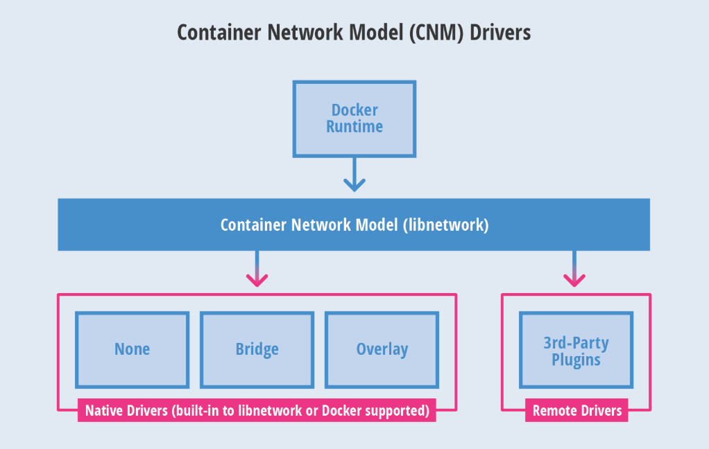
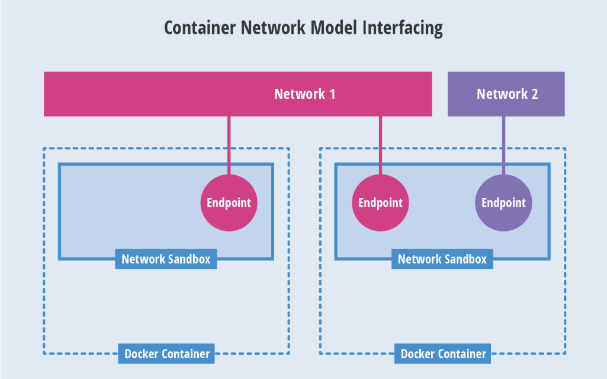
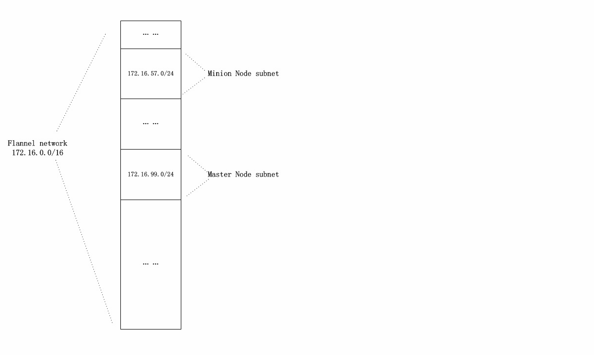
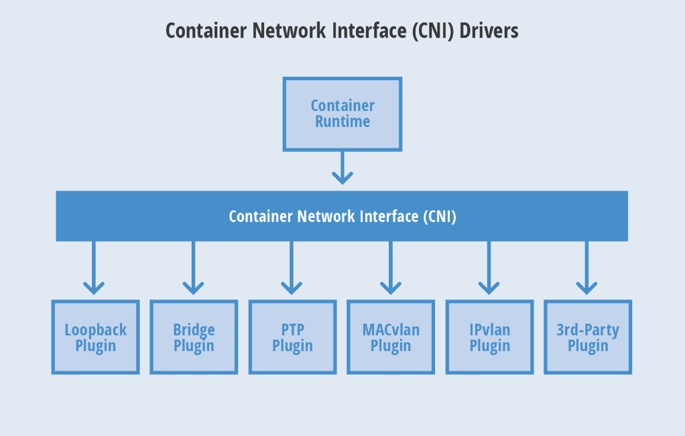
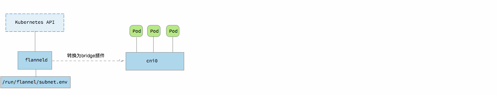
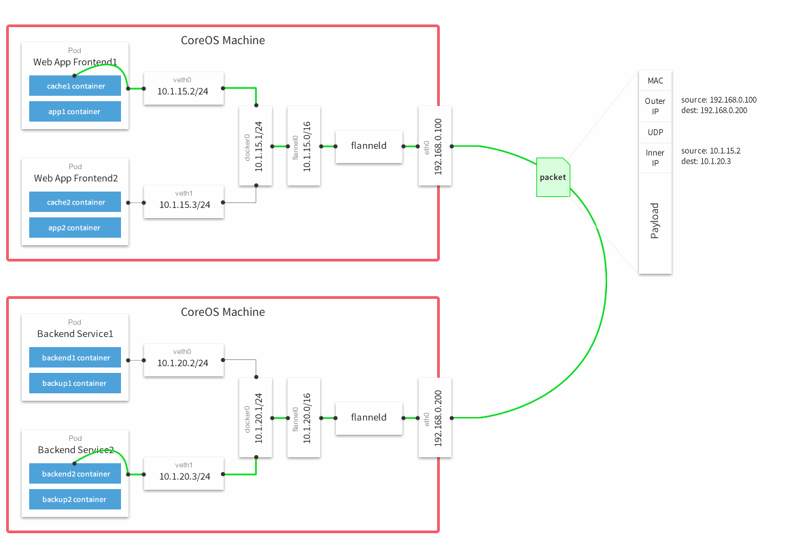

# docker的网络实现
> 用过docker基本都知道，启动docker engine后，主机的网络设备里会有一个docker0的网关，而容器默认情况下会被分配在一个以docker0为网关的虚拟子网中。
```bash
root@VM-66-197-ubuntu:/home/ubuntu# ifconfig
...
docker0   Link encap:Ethernet  HWaddr 02:42:ec:43:56:b2  
          inet addr:172.17.0.1  Bcast:0.0.0.0  Mask:255.255.0.0
...
root@VM-66-197-ubuntu:/home/ubuntu# docker inspect nginx
···
"IPAddress": "172.17.0.2",
···
```
> 1、为了实现上述功能，docker主要用到了linux的Bridge、Network Namespace、VETH。   
> 2、Bridge相当于是一个虚拟网桥，工作在第二层网络。也可以为它配置IP，工作在三层网络。docker0网关就是通过Bridge实现的。   
> 3、Network Namespace是网络命名空间，通过Network Namespace可以建立一些完全隔离的网络栈。比如通过docker network create xxx就是在建立一个Network Namespace。  
> 4、VETH是虚拟网卡的接口对，可以把两端分别接在两个不同的Network Namespace中，实现两个原本隔离的Network Namespace的通信。  
> 5、所以总结起来就是：Network Namespace做了容器和宿主机的网络隔离，Bridge分别在容器和宿主机建立一个网关，然后再用VETH将容器和宿主机两个网络空间连接起来。  

## CNM(container network model)
**基于上面的网络实现，docker的容器网络管理项目libnetwork提出了CNM（container network model）**


> 1、Sandbox：每个沙盒包含一个容器网络栈(network stack)的配置，配置包括：容器的网口、路由表和DNS设置等。  
> 2、Endpoint：通过Endpoint，沙盒可以被加入到一个Network里。  
> 3、Network：一组能相互直接通信的Endpoints。  
**Sandbox对应于Network Namespace， Endpoint对应于VETH， Network对应于Bridge。**

# Pod Network
**Kubernetes的一个Pod中包含有多个容器，这些容器共享一个Network Namespace，更具体的说，是共享一个Network Namespace中的一个IP。创建Pod时，首先会生成一个pause容器，然后其他容器会共享pause容器的网络**
```bash
root@kube-2:~# docker ps
CONTAINER ID        IMAGE                                            COMMAND                  CREATED             STATUS              PORTS               NAMES
d2dbb9e288e2        mirrorgooglecontainers/pause-amd64:3.0           "/pause"                 3 weeks ago         Up 3 weeks                              k8s_POD_frontend-647d9fdddf-n4x9w_default_9f275ea8-4853-11e8-8c42-fa163e4a07e5_0
cf1bfff28238        nginx                                            "nginx -g 'daemon of…"   3 weeks ago         Up 3 weeks                              k8s_nginx-demo_frontend-647d9fdddf-n4x9w_default_9f275ea8-4853-11e8-8c42-fa163e4a07e5_0

root@kube-2:~# docker inspect cf1bf
...
            "NetworkMode": "container:d2dbb9e288e26231759e28e8d4816862c6c57d4d2822a259bee7fcc9a2fd0b20",
...
```
> 1、可以看出，在这个Pod中，nginx容器通过"NetworkMode": "container:d2db..."与pause容器共享了网络。这时候，相同容器之间的访问只需要用localhost+端口的形式，就像他们是部署在同一台物理机的不同进程一样，可以使用本地IPC进行通信。   
> 2、然而pause的ip又是从哪里分配到的？如果还是用一个以docker0为网关的内网ip就会出现问题了。   
> 3、docker默认的网络是为同一台宿主机的docker容器通信设计的，Kubernetes的Pod需要跨主机与其他Pod通信，所以需要设计一套让不同Node的Pod实现透明通信（without NAT）的机制。   
> 4、docker0的默认ip是172.17.0.1，docker启动的容器也默认被分配在172.17.0.1/16的网段里。跨主机的Pod通信要保证Pod的ip不能相同，所以还需要设计一套为Pod统一分配IP的机制。   
> 5、以上两点，就是Kubernetes在Pod network这一层需要解决的问题。幸运的是有很多的网络工具已经实现了上述功能，所以Kubernetes选择了与这些工具结合。官方文档上可以看看有哪些网络插件可以使用https://kubernetes.io/docs/concepts/cluster-administration/networking/#how-to-achieve-this   

## flannel网络插件
**我在部署Kubernetes的时候，使用的是flannel，所以就根据flannel来说一下，etcd在Node中充当网络插件的网络状态同步组件。而flannel的功能实现就依赖于etcd**

> 1、首先在启动Kubernetes Controller Manager时，需要指定集群的pod ip范围：--cluster-cidr=172.16.0.0/16,并开启为Node分配ip选项：--allocate-node-cidrs=true(参考kubeasz的配置)。Controller Manager会把为每个Node分配的IP范围保存到etcd中。  
> 2、新建Pod时，flannel会从etcd中取出属于该Node的ip，分配给Pod，再在etcd中记录下这个Pod的IP。这样etcd中就会存有一张Node IP与Pod IP对应的“路由表”。  
> 3、当Pod需要跨Node通信时，数据包经过Node中的路由会到flannel中，flannel通过etcd查询到目的Pod IP的Node IP，使用flannel的Backends对数据包进行分装，发送给目的Node处理。目的Node拿到数据包后解开封装，拿到原始数据包，再通过Node的路由送到相应的Pod。  
> 4、flannel的Backends有多种实现方式：VXLAN、UDP、gce.....具体参考官方文档。

**flannel为Pod分配ip有不同的实现方式，Kubernetes推荐的是基于CNI，另一种是结合CNM**
## 基于CNI（container network interface）
> Container Network Interface (CNI) 最早是由CoreOS发起的容器网络规范，是Kubernetes网络插件的基础。其基本思想为：Container Runtime在创建容器时，先创建好network namespace，然后调用CNI插件为这个netns配置网络，其后再启动容器内的进程。现已加入CNCF，成为CNCF主推的网络模型。  

> 这个协议连接了两个组件：容器管理系统和网络插件。它们之间通过 JSON 格式的文件进行通信，实现容器的网络功能。具体的事情都是插件来实现的，包括：创建容器网络空间（network namespace）、把网络接口（interface）放到对应的网络空间、给网络接口分配 IP 等等。  
**使用CNI后，容器的IP分配就变成了如下步骤：**
> 1、kubelet 先创建pause容器生成network namespace  
> 2、调用网络CNI driver  
> 3、CNI driver 根据配置调用具体的cni 插件  
> 4、cni 插件给pause 容器配置网络  
> 5、pod 中其他的容器都使用 pause 容器的网络  

**这时候Pod就直接以cni0作为了自己的网关，而不是docker默认的docker0。所以使用docker inspect查看某个pause容器时，是看不到它的网络信息的,kubeasz就是基于这种方式部署的flannel**

## 基于docker CNM
**这种方式需要把/run/flannel/subnet.env中的内容写到docker的环境变量配置文件/run/flannel/docker中，然后在docker engine启动时带上相应参数EnvironmentFile=-/run/flannel/docker。这样docker0的ip地址就会是flannel为该Node分配的地址了。**

**这样子Pod IP是docker engine分配的，Pod也是以docker0为网关，通过veth连接network namespace，符合CNM中的定义。**

## 比较
> 1、相比起来，明显是Kubernetes推荐的CNI模式要好一些。  
> 2、CNI中，docker0的ip与Pod无关，Pod总是生成的时候才去动态的申请自己的IP，而CNM模式下，Pod的网段在docker engine启动时就已经决定。  
> 3、CNI只是一个网络接口规范，各种功能都由插件实现，flannel只是插件的一种，而且docker也只是容器载体的一种选择，Kubernetes还可以使用其他的，比如rtk...官方博客也对此做过说明：Why Kubernetes doesn’t use libnetwork  


