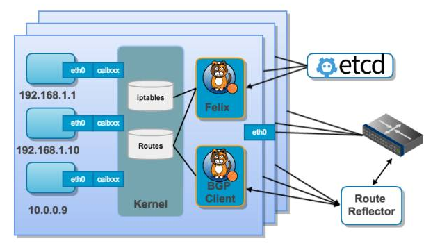

# Kubernetes中的网络解析——以calico为例
> 概念   
> > 1. Calico 创建和管理一个扁平的三层网络(不需要overlay)，每个容器会分配一个可路由的ip。由于通信时不需要解包和封包，网络性能损耗小，易于排查，且易于水平扩展。   
> > 2. 小规模部署时可以通过bgp client直接互联，大规模下可通过指定的BGP route reflector来完成，这样保证所有的数据流量都是通过IP路由的方式完成互联的。 Calico基于iptables还提供了丰富而灵活的网络Policy，保证通过各个节点上的ACLs来提供Workload的多租户隔离、安全组以及其他可达性限制等功能。   
> >
> Calico架构   

> calico主要由Felix,etcd,BGP client,BGP Route Reflector组成。   
> > 1. Etcd：负责存储网络信息   
> > 2. BGP client：负责将Felix配置的路由信息分发到其他节点   
> > 3. Felix：Calico Agent，每个节点都需要运行，主要负责配置路由、配置ACLs、报告状态   
> > 4. BGP Route Reflector：大规模部署时需要用到，作为BGP client的中心连接点，可以避免每个节点互联   
>>
> 部署   
```bash
mkdir /etc/cni/net.d/

kubectl apply -f https://docs.projectcalico.org/v3.0/getting-started/kubernetes/installation/rbac.yaml

wget https://docs.projectcalico.org/v3.0/getting-started/kubernetes/installation/hosted/calico.yaml

修改etcd_endpoints的值和默认的192.168.0.0/16(不能和已有网段冲突)

kubectl apply -f calico.yaml

wget  https://github.com/projectcalico/calicoctl/releases/download/v2.0.0/calicoctl

mv calicoctl /usr/loca/bin && chmod +x /usr/local/bin/calicoctl

calicoctl get ippool

calicoctl get node
``` 

## 参考
> 1. [部署](https://docs.projectcalico.org/v3.0/usage/calicoctl/install)   
> 2. [calicoctl命令](https://docs.projectcalico.org/v3.0/reference/calicoctl/commands/)   
> 3. [架构](https://docs.projectcalico.org/v3.0/reference/architecture/)


