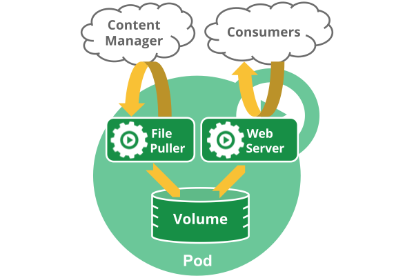
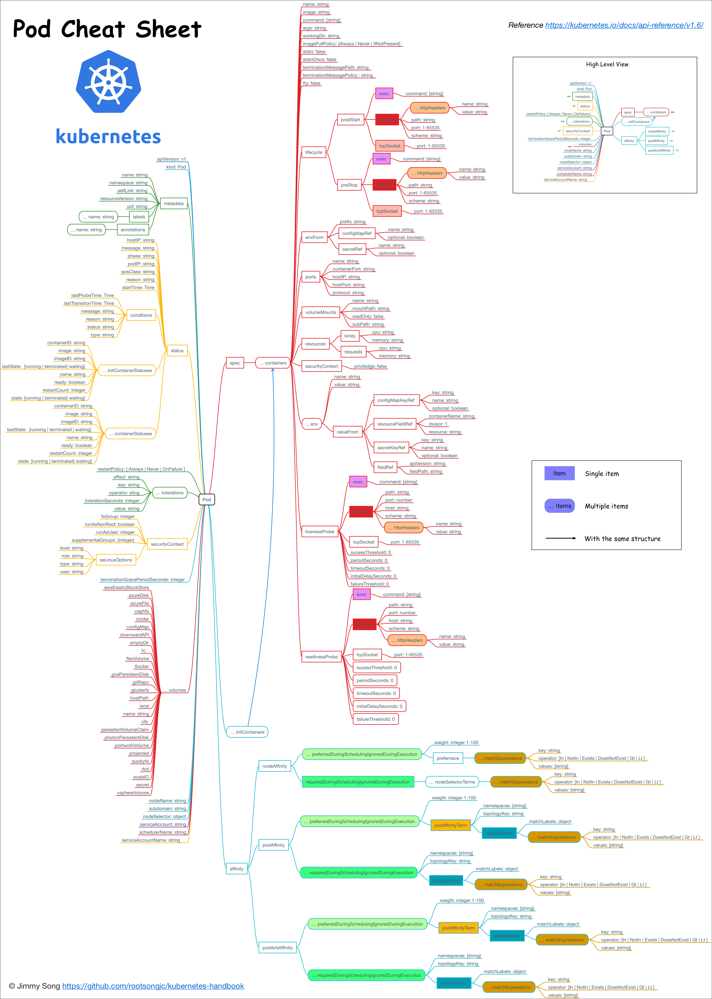

# Pod状态与生命周期管理
> 该节将带领大家了解Kubernetes中的基本概念，尤其是作为Kubernetes中调度的最基本单位Pod。   
> 本节中包括以下内容：   
> > 1. 了解Pod的构成   
> > 2. Pod的生命周期   
> > 3. Pod中容器的启动顺序模板定义   
> >
> Kubernetes中的基本组件kube-controller-manager就是用来控制Pod的状态和生命周期的，在了解各种controller之前我们有必要先了解下Pod本身和其生命周期。

# Pod概览
## 理解Pod
> 1. Pod是kubernetes中你可以创建和部署的最小也是最简的单位。一个Pod代表着集群中运行的一个进程。   
> 2. Pod中封装着应用的容器（有的情况下是好几个容器），存储、独立的网络IP，管理容器如何运行的策略选项。Pod代表着部署的一个单位：kubernetes中应用的一个实例，可能由一个或者多个容器组合在一起共享资源。   
> > **Docker是kubernetes中最常用的容器运行时，但是Pod也支持其他容器运行时。**
> >
> 在Kubrenetes集群中Pod有如下两种使用方式：   
> > 1. **一个Pod中运行一个容器**。“每个Pod中一个容器”的模式是最常见的用法；在这种使用方式中，你可以把Pod想象成是单个容器的封装，kuberentes管理的是Pod而不是直接管理容器。   
> > 2. **在一个Pod中同时运行多个容器**。一个Pod中也可以同时封装几个需要紧密耦合互相协作的容器，它们之间共享资源。这些在同一个Pod中的容器可以互相协作成为一个service单位——一个容器共享文件，另一个“sidecar”容器来更新这些文件。Pod将这些容器的存储资源作为一个实体来管理。   
> >
> 每个Pod都是应用的一个实例。如果你想平行扩展应用的话（运行多个实例），你应该运行多个Pod，每个Pod都是一个应用实例。在Kubernetes中，这通常被称为replication。

### Pod中如何管理多个容器
> 1. Pod中可以同时运行多个进程（作为容器运行）协同工作。同一个Pod中的容器会自动的分配到同一个 node 上。同一个Pod中的容器共享资源、网络环境和依赖，它们总是被同时调度。   
> 2. 注意在一个Pod中同时运行多个容器是一种比较高级的用法。只有当你的容器需要紧密配合协作的时候才考虑用这种模式。例如，你有一个容器作为web服务器运行，需要用到共享的volume，有另一个“sidecar”容器来从远端获取资源更新这些文件，如下图所示：   
   
>> **Pod中可以共享两种资源：网络和存储。**   
>>

### 网络
> 每个Pod都会被分配一个唯一的IP地址。Pod中的所有容器共享网络空间，包括IP地址和端口。Pod内部的容器可以使用localhost互相通信。Pod中的容器与外界通信时，必须分配共享网络资源（例如使用宿主机的端口映射）。   

### 存储
> 可以Pod指定多个共享的Volume。Pod中的所有容器都可以访问共享的volume。Volume也可以用来持久化Pod中的存储资源，以防容器重启后文件丢失。   

## 使用Pod
> 1. 你很少会直接在kubernetes中创建单个Pod。因为Pod的生命周期是短暂的，用后即焚的实体。当Pod被创建后（不论是由你直接创建还是被其他Controller），都会被Kuberentes调度到集群的Node上。直到Pod的进程终止、被删掉、因为缺少资源而被驱逐、或者Node故障之前这个Pod都会一直保持在那个Node上。   
> > **注意：重启Pod中的容器跟重启Pod不是一回事。Pod只提供容器的运行环境并保持容器的运行状态，重启容器不会造成Pod重启。**   
> >
> 2. Pod不会自愈。如果Pod运行的Node故障，或者是调度器本身故障，这个Pod就会被删除。同样的，如果Pod所在Node缺少资源或者Pod处于维护状态，Pod也会被驱逐。Kubernetes使用更高级的称为Controller的抽象层，来管理Pod实例。虽然可以直接使用Pod，但是在Kubernetes中通常是使用Controller来管理Pod的。   

### Pod和Controller
> 1. Controller可以创建和管理多个Pod，提供副本管理、滚动升级和集群级别的自愈能力。例如，如果一个Node故障，Controller就能自动将该节点上的Pod调度到其他健康的Node上。   
> 2. 包含一个或者多个Pod的Controller示例：   
> > 1. Deployment   
> > 2. StatefulSet   
> > 3. DaemonSet   
> >
> 3. 通常，Controller会用你提供的Pod Template来创建相应的Pod。

### Pod Templates
> Pod模版是包含了其他object的Pod定义，例如Replication Controllers，Jobs和 DaemonSets。Controller根据Pod模板来创建实际的Pod。

# Pod详解
## 什么是Pod？
> 1. Pod就像是豌豆荚一样，它由一个或者多个容器组成（例如Docker容器），它们共享容器存储、网络和容器运行配置项。Pod中的容器总是被同时调度，有共同的运行环境。你可以把单个Pod想象成是运行独立应用的“逻辑主机”——其中运行着一个或者多个紧密耦合的应用容器——在有容器之前，这些应用都是运行在几个相同的物理机或者虚拟机上。   
> 2. 尽管kubernetes支持多种容器运行时，但是Docker依然是最常用的运行时环境，我们可以使用Docker的术语和规则来定义Pod。   
> 3.Pod中共享的环境包括Linux的namespace、cgroup和其他可能的隔绝环境，这一点跟Docker容器一致。在Pod的环境中，每个容器中可能还有更小的子隔离环境。   
> 4. Pod中的容器共享IP地址和端口号，它们之间可以通过localhost互相发现。它们之间可以通过进程间通信，例如SystemV信号或者POSIX共享内存。不同Pod之间的容器具有不同的IP地址，不能直接通过IPC通信。   
> 5. Pod中的容器也有访问共享volume的权限，这些volume会被定义成pod的一部分并挂载到应用容器的文件系统中。   
> 6. 根据Docker的结构，Pod中的容器共享namespace和volume，不支持共享PID的namespace。   
> 7. 就像每个应用容器，pod被认为是临时（非持久的）实体。在Pod的生命周期中讨论过，pod被创建后，被分配一个唯一的ID（UID），调度到节点上，并一致维持期望的状态直到被终结（根据重启策略）或者被删除。如果node死掉了，分配到了这个node上的pod，在经过一个超时时间后会被重新调度到其他node节点上。一个给定的pod（如UID定义的）不会被“重新调度”到新的节点上，而是被一个同样的pod取代，如果期望的话甚至可以是相同的名字，但是会有一个新的UID。   
> 8. Volume跟pod有相同的生命周期（当其UID存在的时候）。当Pod因为某种原因被删除或者被新创建的相同的Pod取代，它相关的东西（例如volume）也会被销毁和再创建一个新的volume。   
   
> **一个多容器Pod，包含文件提取程序和Web服务器，该服务器使用持久卷在容器之间共享存储。**

# Pod的动机
## 管理
> Pod是一个服务的多个进程的聚合单位，pod提供这种模型能够简化应用部署管理，通过提供一个更高级别的抽象的方式。Pod作为一个独立的部署单位，支持横向扩展和复制。共生（协同调度），命运共同体（例如被终结），协同复制，资源共享，依赖管理，Pod都会自动的为容器处理这些问题。   

## 资源共享和通信
> 1. Pod中的应用可以共享网络空间（IP地址和端口），因此可以通过localhost互相发现。因此，pod中的应用必须协调端口占用。每个pod都有一个唯一的IP地址，跟物理机和其他pod都处于一个扁平的网络空间中，它们之间可以直接连通。   
> 2. Pod中应用容器的hostname被设置成Pod的名字。   
> 3. Pod中的应用容器可以共享volume。Volume能够保证pod重启时使用的数据不丢失。   

## Pod应用方式
> Pod也可以用于垂直应用栈（例如LAMP），这样使用的主要动机是为了支持共同调度和协调管理应用程序，例如：   
> > 1. 内容管理系统、文件和数据加载器、本地换群管理器等。   
> > 2. 日志和检查点备份、压缩、旋转、快照等。   
> > 3. 数据变更观察者、日志和监控适配器、活动发布者等。   
> > 4. 代理、桥接和适配器等。   
> > 5. 控制器、管理器、配置器、更新器等。   
> >
> 通常单个pod中不会同时运行一个应用的多个实例。

# 其他替代选择
> **为什么不直接在一个容器中运行多个应用程序呢？**
> > 1. **透明**。让Pod中的容器对基础设施可见，以便基础设施能够为这些容器提供服务，例如进程管理和资源监控。这可以为用户带来极大的便利。   
> > 2. **解耦软件依赖**。每个容器都可以进行版本管理，独立的编译和发布。未来kubernetes甚至可能支持单个容器的在线升级。   
> > 3. **使用方便**。用户不必运行自己的进程管理器，还要担心错误信号传播等。   
> > 4. **效率**。因为由基础架构提供更多的职责，所以容器可以变得更加轻量级。   
> >
> **为什么不支持容器的亲和性的协同调度？**   
> > 这种方法可以提供容器的协同定位，能够根据容器的亲和性进行调度，但是无法实现使用pod带来的大部分好处，例如资源共享，IPC，保持状态一致性和简化管理等。

## Pod的持久性（或者说缺乏持久性） 
> 1. Pod在设计支持就不是作为持久化实体的。在调度失败、节点故障、缺少资源或者节点维护的状态下都会死掉会被驱逐。   
> 2. 通常，用户不需要手动直接创建Pod，而是应该使用controller（例如Deployments），即使是在创建单个Pod的情况下。Controller可以提供集群级别的自愈功能、复制和升级管理。   
> 3. 使用集合API作为主要的面向用户的原语在集群调度系统中相对常见，包括Borg、Marathon、Aurora和Tupperware。   
> 4. Pod 原语有利于：   
> > 1. 调度程序和控制器可插拔性   
> > 2. 支持pod级操作，无需通过控制器API“代理”它们   
> > 3. 将pod生命周期与控制器生命周期分离，例如用于自举（bootstrap）   
> > 4. 控制器和服务的分离——端点控制器只是监视pod   
> > 5. 将集群级功能与Kubelet级功能的清晰组合——Kubelet实际上是“pod控制器”   
> > 6. 高可用性应用程序，它们可以在终止之前及在删除之前更换pod，例如在计划驱逐、镜像预拉取或实时pod迁移的情况下[#3949](https://github.com/kubernetes/kubernetes/issues/3949)   
> > 
> 5. StatefulSet 控制器支持有状态的Pod。在1.4版本中被称为PetSet。在kubernetes之前的版本中创建有状态pod的最佳方式是创建一个replica为1的replication controller。   

## Pod的终止
> 因为Pod作为在集群的节点上运行的进程，所以在不再需要的时候能够优雅的终止掉是十分必要的（比起使用发送KILL信号这种暴力的方式）。用户需要能够放松删除请求，并且知道它们何时会被终止，是否被正确的删除。用户想终止程序时发送删除pod的请求，在pod可以被强制删除前会有一个宽限期，会发送一个TERM请求到每个容器的主进程。一旦超时，将向主进程发送KILL信号并从API server中删除。如果kubelet或者container manager在等待进程终止的过程中重启，在重启后仍然会重试完整的宽限期。   
> **示例流程如下：**   
> > 1. 用户发送删除pod的命令，默认宽限期是30秒；   
> > 2. 在Pod超过该宽限期后API server就会更新Pod的状态为“dead”；   
> > 3. 在客户端命令行上显示的Pod状态为“terminating”；   
> > 4. 跟第三步同时，当kubelet发现pod被标记为“terminating”状态时，开始停止pod进程：   
> >> 1. 如果在pod中定义了preStop hook，在停止pod前会被调用。如果在宽限期过后，preStop hook依然在运行，第二步会再增加2秒的宽限期；   
> >> 2. 向Pod中的进程发送TERM信号；   
> >>
> > 5. 跟第三步同时，该Pod将从该service的端点列表中删除，不再是replication controller的一部分。关闭的慢的pod将继续处理load balancer转发的流量；   
> > 6. 过了宽限期后，将向Pod中依然运行的进程发送SIGKILL信号而杀掉进程。   
> > 7. Kublete会在API server中完成Pod的的删除，通过将优雅周期设置为0（立即删除）。Pod在API中消失，并且在客户端也不可见。   
> >
> 删除宽限期默认是30秒。 kubectl delete命令支持 —grace-period=<seconds> 选项，允许用户设置自己的宽限期。如果设置为0将强制删除pod。在kubectl>=1.5版本的命令中，你必须同时使用 --force 和 --grace-period=0 来强制删除pod。

## 强制删除Pod
> 1. Pod的强制删除是通过在集群和etcd中将其定义为删除状态。当执行强制删除命令时，API server不会等待该pod所运行在节点上的kubelet确认，就会立即将该pod从API server中移除，这时就可以创建跟原pod同名的pod了。这时，在节点上的pod会被立即设置为terminating状态，不过在被强制删除之前依然有一小段优雅删除周期。   
> 2. 强制删除对于某些pod具有潜在危险性，请谨慎使用。使用StatefulSet pod的情况下，请参考删除StatefulSet中的pod文章。   

## Pod中容器的特权模式
> 1. 从Kubernetes1.1版本开始，pod中的容器就可以开启previleged模式，在容器定义文件的 SecurityContext 下使用 privileged flag。 这在使用Linux的网络操作和访问设备的能力时是很有用的。容器内进程可获得近乎等同于容器外进程的权限。在不需要修改和重新编译kubelet的情况下就可以使用pod来开发节点的网络和存储插件。   
> 2. 如果master节点运行的是kuberentes1.1或更高版本，而node节点的版本低于1.1版本，则API server将也可以接受新的特权模式的pod，但是无法启动，pod将处于pending状态。   
> 3. 执行 kubectl describe pod FooPodName，可以看到为什么pod处于pending状态。输出的event列表中将显示： Error validating pod "FooPodName"."FooPodNamespace" from api, ignoring: spec.containers[0].securityContext.privileged: forbidden '<*>(0xc2089d3248)true'   
> 4. 如果master节点的版本低于1.1，无法创建特权模式的pod。如果你仍然试图去创建的话，你得到如下错误：The Pod "FooPodName" is invalid. spec.containers[0].securityContext.privileged: forbidden '<*>(0xc20b222db0)true'   

## API Object
> Pod是kubernetes REST API中的顶级资源类型。在kuberentes1.6的V1 core API版本中的Pod的数据结构如下图所示：   

