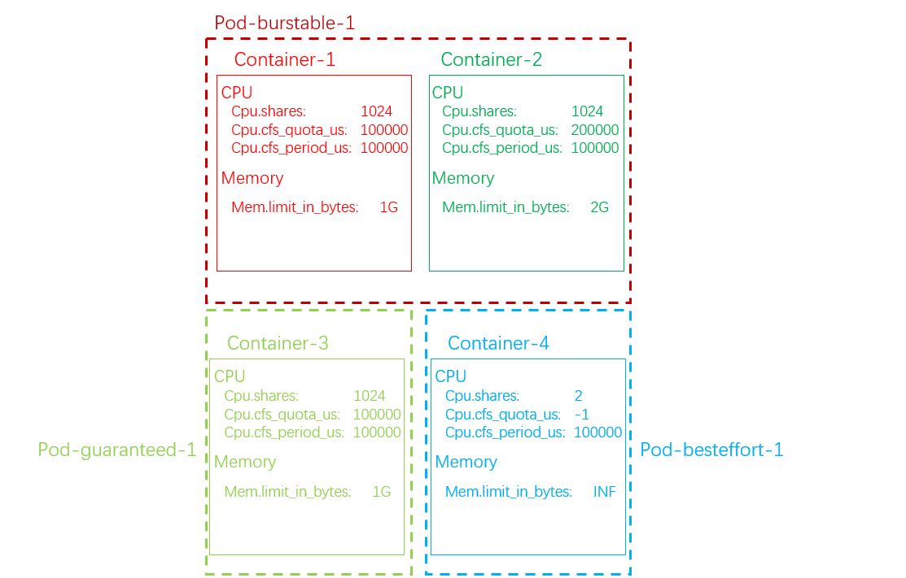

#  kubernetes 资源管理
> 1. 资源，无论是计算资源、存储资源、网络资源，对于容器管理调度平台来说都是需要关注的一个核心问题。   
> 2. 这些问题都是平台开发者需要仔细思考的。当然， kubernetes 在这个方面也提出了很多精巧、实用的设计方案。   

# 思路
>  如何对资源进行抽象、定义? 如何确认实际可以使用的资源量? 如何为容器分配它所申请的资源？   
> > 1.  首先我们关注的是 kubernetes 对各种资源的抽象模型，也就是回答第一个问题：kubernetes 是如何对资源进行抽象和定义的呢?    
> > 2.  然后我们将关注，kubernetes 是如何获取它可以使用的资源量的信息的。   
> > 3. 在弄清楚 kubernetes 是如何定义资源，以及如何确认可用资源量后，我们将关注 kubernetes 是如何实际为 pod 分配资源的。   

# Kubernetes 资源模型
## Kubernetes 是怎么定义资源的呢?   
> 1. 在 kubernetes 中，任何可以被申请、分配，最终被使用的对象，都是 kubernetes 中的资源，比如 CPU、内存。   
> 2. 而且针对每一种被 kubernetes 所管理的资源，都会被赋予一个【资源类型名】，这些名字都是符合 RFC 1123 规则的，比如 CPU，它对应的资源名全称为 kubernetes.io/cpu（在展示时一般直接简写为 cpu）；GPU 资源对应的资源名为 alpha.kubernetes.io/nvidia-gpu。   
> 3. 除了名字以外，针对每一种资源还会对应有且仅有一种【基本单位】。这个基本单位一般是在 kubernetes 组件内部统一用来表示这种资源的数量的，比如 memory 的基本单位就是字节。   
> 4. 但是为了方便开发者使用，在开发者通过 yaml 文件或者 kubectl 同 kubernetes 进行交互时仍可以使用多种可读性更好的资源单位，比如内存的 Gi。而当这些信息进入 kubernetes 内部后，还是会被显式的转换为最基本单位。   
> 5. 所有的资源类型，又可以被划分为两大类：可压缩(compressible)和不可压缩(incompressible)的。其评判标准就在于：如果系统限制或者缩小容器对可压缩资源的使用的话，只会影响服务对外的服务性能，比如 CPU 就是一种非常典型的可压缩资源。   
> 6. 对于不可压缩资源来说，资源的紧缺是有可能导致服务对外不可用的，比如内存就是一种非常典型的不可压缩资源。   

## Kubernetes 中有哪几类资源呢？   
> 1. 目前 kubernetes 默认带有两类基本资源   
> > 1. CPU   
> > 2. memory   
> >
> 2. 其中 CPU，不管底层的机器是通过何种方式提供的（物理机 or 虚拟机），一个单位的 CPU 资源都会被标准化为一个标准的 "Kubernetes Compute Unit" ，大致和 x86 处理器的一个单个超线程核心是相同的。   
> 3. CPU 资源的基本单位是 millicores，因为 CPU 资源其实准确来讲，指的是 CPU 时间。所以它的基本单位为 millicores，1 个核等于 1000 millicores。也代表了 kubernetes 可以将单位 CPU 时间细分为 1000 份，分配给某个容器。   
> 4. memory 资源的基本单位比较好理解，就是字节。   
> 5. 另外，kubernetes 针对用户的自定制需求，还为用户提供了 device plugin 机制，让用户可以将资源类型进一步扩充，比如现在比较常用的 nvidia gpu 资源。这个特性可以使用户能够在 kubernetes 中管理自己业务中特有的资源，并且无需修改 kubernetes 自身源码。   
> 6. 而且 kubernetes 自身后续还会进一步支持更多非常通用的资源类型，比如网络带宽、存储空间、存储 iops 等等。   


# Kubernetes 计算节点资源管理
## Kubernetes 如何确定可以使用的资源量呢？   
> 1. kubernetes 所管理的集群中的每一台计算节点都包含一定的资源，kubernetes 是如何获知这台计算节点有多少资源的呢？这些资源中又有多少可以被用户容器所使用呢？   
> 2. 我们在使用 kubernetes 时会发现：每一个 Node 对象的信息中，有关资源的描述部分如下述所示 （通过 kubectl get node xxx -o yaml 命令可以得到）   

```bash
allocatable:    
  cpu: "40"    
  memory: 263927444Ki    
  pods: "110"  
capacity:    
  cpu: "40"    
  memory: 264029844Ki    
  pods: "110"
```
> 3. 其中 【capacity】 就是这台 Node 的【资源真实量】，比如这台机器是 8核 32G 内存，那么在 capacity 这一栏中就会显示 CPU 资源有 8 核，内存资源有 32G（内存可能是通过 Ki 单位展示的）。   
> 4. 而 【allocatable】 指的则是这台机器【可以被容器所使用的资源量】。在任何情况下，allocatable 是一定小于等于 capacity 的。   
> 5. 比如刚刚提到的 8 核机器的，它的 CPU capacity 是 8 核，但是它的 cpu allocatable 量可以被调整为 6 核，也就是说调度到这台机器上面的容器一共最多可以使用 6 核 CPU，另外 2 核 CPU 可以被机器用来给其他非容器进程使用。   

## Capacity 和 allocatable 信息都是如何确定的呢？
> 1. 首先看 【capacity】 ，由于 capacity 反映的是这台机器的资源真实数量，所以确认这个信息的任务理所应当交给运行在每台机器上面的 kubelet 上。   
> 2. kubelet 目前把 cadvisor 的大量代码直接作为 vendor 引入。其实就相当于在 kubelet 内部启动了一个小的 cadvisor。在 kubelet 启动后，这个内部的 cadvisor 子模块也会相应启动，并且获取这台机器上面的各种信息。其中就包括了有关这台机器的资源信息，而这个信息也自然作为这台机器的真实资源信息，通过 kubelet 再上报给 apiserver。   

## Allocatable 信息又是如何确认的呢？
> 1. 如果要介绍 allocatable 信息如何确认，首先必须介绍 Node Allocatable Resource 特性 [6]。Node Allocatable Resource 特性是由 kubernetes 1.6 版本引进的一个特性。主要解决的问题就是：为每台计算节点的【非容器进程】预留资源。   
> 2. 在 kubernetes 集群中的每一个节点上，除了用户容器还会运行很多其他的重要组件，他们并不是以容器的方式来运行的，这些组件的类型主要分为两个大类：   
> > 1. kubernetes daemon：kubernetes 相关的 daemon 程序，比如 kubelet，dockerd 等等。    
> > 2. system daemon：和 kubernetes 不相关的其他系统级 daemon 程序，比如 sshd 等等。   
> >
> 3. 这两种进程对于整个物理机稳定的重要性是毋庸置疑的。所以针对这两种进程，kubernetes 分别提供了 Kube-Reserved 和 System-Reserved 特性，可以分别为这两组进程设定一个预留的计算资源量，比如预留 2 核 4G 的计算资源给系统进程用。    

## Kubernetes 是如何实现这一点的呢？
> 1. 我们应该都有了解，kubernetes 底层是通过 cgroup 特性来实现资源的隔离与限制的，而这种资源的预留也是通过 cgroup 技术来实现的。   
> 2. 在默认情况下，针对每一种基本资源（CPU、memory），kubernetes 首先会创建一个根 cgroup 组，作为所有容器 cgroup 的根，名字叫做kubepods。这个 cgroup 就是用来限制这台计算节点上所有 pod 所使用的资源的。默认情况下这个 kubepods cgroup 组所获取的资源就等同于该计算节点的全部资源。   
> 3. 但是，当开启 Kube-Reserved 和 System-Reserved 特性时，kubernetes 则会为 kubepods cgroup 再创建两个同级的兄弟 cgroup，分别叫做 kube-reserved 和 system-reserved，分别用来为 kubernetes daemon、system daemon 预留一定的资源并且与 kubepods cgroup 共同分配这个机器的资源。所以 kubepods 能够被分配到的资源势必就会小于机器的资源真实量了，这样从而就达到了为 kubernetes daemon，system daemon 预留资源的效果。   
> 4. 所以如果开启了 Kube-Reserved 和 System-Reserved 的特性的话，在计算 Node Allocatable 资源数量时必须把这两个 cgroup 占用的资源先减掉。   
> 5. 所以，假设当前机器 CPU 资源的 Capacity 是 32 核，然后我们分别设置 Kube-Reserved 为 2 核，System-Reserved 为 1 核，那么这台机器真正能够被容器所使用的 CPU 资源只有 29 核。   
> 6. 但是在计算 memory 资源的 allocatable 数量时，除了 Kube-Reserved，System-Reserved 之外，还要考虑另外一个因素。那就是 Eviction Threshold。   

### 什么是 Eviction Threshold 呢？
> 1. Eviction Threshold 对应的是 kubernetes 的 eviction policy 特性。该特性也是 kubernetes 引入的用于保护物理节点稳定性的重要特性。当机器上面的【内存】以及【磁盘资源】这两种不可压缩资源严重不足时，很有可能导致物理机自身进入一种不稳定的状态，这个很显然是无法接受的。   
> 2. 所以 kubernetes 官方引入了 eviction policy 特性，该特性允许用户为每台机器针对【内存】、【磁盘】这两种不可压缩资源分别指定一个 eviction hard threshold, 即资源量的阈值。   
> 3. 比如我们可以设定内存的 eviction hard threshold 为 100M，那么当这台机器的内存可用资源不足 100M 时，kubelet 就会根据这台机器上面所有 pod 的 QoS 级别（Qos 级别下面会介绍），以及他们的内存使用情况，进行一个综合排名，把排名最靠前的 pod 进行迁移，从而释放出足够的内存资源。   
> 4. 所以针对内存资源，它的 allocatable 应该是 [capacity] - [kube-reserved] - [system-reserved] - [hard-eviction]   
> 5. 所以，如果仔细观察你会发现：如果你的集群中没有开启 kube-reserved，system-reserved 特性的话，通过 kubectl get node <node_name> -o yaml 会发现这台机器的 CPU Capacity 是等于 CPU Allocatable 的，但是 Memory Capacity 却始终大于 Memory Allocatable。主要是因为 eviction 机制，在默认情况下，会设定一个 100M 的 memory eviction hard threshold，默认情况下，memory capacity 和 memory allocatable 之间相差的就是这 100M。   

# Kubernetes pod 资源管理与分配
> 1. 通过上面我们了解了 kubernetes 如何定义并且确认在当前集群中有多少可以被利用起来的资源后，下面就来看一下 kubernetes 到底如何将这些资源分配给每一个 pod 的。   
> 2. 在介绍如何把资源分配给每一个 pod 之前，我们首先要看一下 pod 是如何申请资源的。这个对于大多数已经使用过 kubernetes 的童鞋来讲，并不是很陌生。   

## Kubernetes pod 资源申请方式
> 1. kubernetes 中 pod 对资源的申请是以容器为最小单位进行的，针对每个容器，它都可以通过如下两个信息指定它所希望的资源量： • request • limit   

```bash
 resources:  
  requests:    
    cpu: 2.5   
    memory: "40Mi"  
  limits:     
    cpu: 4.0    
    memory: "99Mi"
```
> 2. 那么 request，limit 分别又代表了什么含义呢？   

### request
> 1. request 指的是针对这种资源，这个容器希望能够保证能够获取到的最少的量。   
> 2. 但是在实际情况下，CPU request 是可以通过 cpu.shares 特性能够实现的。   
> 3. 但是内存资源，由于它是不可压缩的，所以在某种场景中，是有可能因为其他 memory limit 设置比 request 高的容器对内存先进行了大量使用导致其他 pod 连 request 的内存量都有可能无法得到满足。   

### limit
> 1. limit 对于 CPU，还有内存，指的都是容器对这个资源使用的上限。   
> 2. 但是这两种资源在针对容器使用量超过 limit 所表现出的行为也是不同的。   
> 对 CPU 来说，容器使用 CPU 过多，内核调度器就会切换，使其使用的量不会超过 limit。对内存来说，容器使用内存超过 limit，这个容器就会被 OOM kill 掉，从而发生容器的重启。在容器没有指定 request 的时候，request 的值和 limit 默认相等。   
> 3. 而如果容器没有指定 limit 的时候，request 和 limit 会被设置成的值则根据不同的资源有不同的策略。   

## Kubernetes pod QoS 分类
> 1. kubernetes 支持用户容器通过 request、limit 两个字段指定自己的申请资源信息。那么根据容器指定资源的不同情况，Pod 也被划分为 3 种不同的 QoS 级别。分别为：   

### Guaranteed • Burstable • BestEffort
> 1. 不同的 QoS 级别会在很多方面发挥作用，比如调度，eviction。   
> 2. Guaranteed 级别的 pod 主要需要满足两点要求：   
> > 1.  pod 中的每一个 container 都必须包含内存资源的 limit、request 信息，并且这两个值必须相等   
> > 2. pod 中的每一个 container 都必须包含 CPU 资源的 limit、request 信息，并且这两个信息的值必须相等   
> >
> 3. Burstable 级别的 pod 则需要满足两点要求：   
> > 1. 资源申请信息不满足 Guaranteed 级别的要求   
> > 2. pod 中至少有一个 container 指定了 cpu 或者 memory 的 request 信息   
> >
> 4. BestEffort 级别的 pod 需要满足：   
> > pod 中任何一个 container 都不能指定 cpu 或者 memory 的 request，limit 信息   
> >
> 5. 所以通过上面的描述也可以看出来   
> > 1. Guaranteed level 的 Pod 是优先级最高的，系统管理员一般对这类 Pod 的资源占用量比较明确。   
> > 2. Burstable level 的 Pod 优先级其次，管理员一般知道这个 Pod 的资源需求的最小量，但是当机器资源充足的时候，还是希望他们能够使用更多的资源，所以一般 limit > request。   
> > 3. BestEffort level 的 Pod 优先级最低，一般不需要对这个 Pod 指定资源量。所以无论当前资源使用如何，这个 Pod 一定会被调度上去，并且它使用资源的逻辑也是见缝插针。当机器资源充足的时候，它可以充分使用，但是当机器资源被 Guaranteed、Burstable 的 Pod 所抢占的时候，它的资源也会被剥夺，被无限压缩。   

## Kubernetes pod 资源分配原理
> 1. 我们在上面两个小节介绍了:   
> > 1. pod 申请资源的方式    
> > 2. pod 申请资源的方式对应的是什么 QoS 级别   
> >
> 2. 最终，kubelet 就是基于 【pod 申请的资源】 + 【pod 的 QoS 级别】来最终为这个 pod 分配资源的。   
> 3. 而分配资源的根本方法就是基于 cgroup 的机制。   
> 4. kubernetes 在拿到一个 pod 的资源申请信息后，针对每一种资源，他都会做如下几件事情：   
> > 1. 对 pod 中的每一个容器，都创建一个 container level cgroup（注：这一步真实情况是 kubernetes 向 docker daemon 发送命令完成的）。   
> > 2. 然后为这个 pod 创建一个 pod level cgroup ，它会成为这个 pod 下面包含的所有 container level cgroup 的父 cgroup。   
> > 3. 最终，这个 pod level cgroup 最终会根据这个 pod 的 QoS 级别，可能被划分到某一个 QoS level cgroup 中，成为这个 QoS level cgroup 的子 cgroup。   
> > 4. 整个 QoS level cgroup 还是所有容器的根 cgroup - kubepods 的子 cgroup。   
> >
> 5. 所以这个嵌套关系通过下述图片可以比较清晰的展示出来。   

   
> 6. 图中代表了一个 kubernetess 计算节点的 cgroup 的层次结构（对于 cpu、memory 来说 cgroup 层次结构是完全一致的）。可见，所有 pod 的 cgroup 配置都位于 kubepods 这个大的 cgroup 下，而之前介绍的 kube-reserved cgroup 和 system-reserved cgroup 和 kubepods cgroup 位于一级，他们 3 个会共享机器的计算资源。   
> 7. 我们首先看如何确定这个 container 对应的 container level cgroup 和它所在的 pod level cgroup。   

### Container level cgroup
> 1. 首先，每一个 container 的 cgroup 的配置则是根据这个 container 对这种资源的 request、limit 信息来配置的。   
> 2. 我们分别看一下，针对 cpu、memory 两种资源，kubernetes 是如何为每一个容器创建 container 级别的 cgroup 的。   

### CPU 资源
> 1. 首先是 CPU 资源，我们先看一下 CPU request。   
> 2. CPU request 是通过 cgroup 中 CPU 子系统中的 cpu.shares 配置来实现的。   
> 3. 当你指定了某个容器的 CPU request 值为 x millicores 时，kubernetes 会为这个 container 所在的 cgroup 的 cpu.shares 的值指定为 x * 1024 / 1000。即：   

```bash
cpu.shares = (cpu in millicores * 1024) / 1000
```
> 4. 举个栗子，当你的 container 的 CPU request 的值为 1 时，它相当于 1000 millicores，所以此时这个 container 所在的 cgroup 组的 cpu.shares 的值为 1024。   
> 5. 这样做希望达到的最终效果就是即便在极端情况下，即所有在这个物理机上面的 pod 都是 CPU 繁忙型的作业的时候（分配多少 CPU 就会使用多少 CPU），仍旧能够保证这个 container 的能够被分配到 1 个核的 CPU 计算量。其实就是保证这个 container 的对 CPU 资源的最低需求。   
> 6. 所以可见 cpu.request 一般代表的是这个 container 的最低 CPU 资源需求。但是其实仅仅通过指定 cpu.shares 还是无法完全达到上面的效果的，还需要对 QoS level 的 cgroup 进行同步的修改。至于具体实现原理我们在后面会详细介绍。    
> 7. 而针对 cpu limit，kubernetes 是通过 CPU cgroup 控制模块中的 cpu.cfs_period_us，cpu.cfs_quota_us 两个配置来实现的。kubernetes 会为这个 container cgroup 配置两条信息：   

```bash
cpu.cfs_period_us = 100000 (i.e. 100ms)
cpu.cfs_quota_us = quota = (cpu in millicores * 100000) / 1000
```
> 8. 在 cgroup 的 CPU 子系统中，可以通过这两个配置，严格控制这个 cgroup 中的进程对 CPU 的使用量，保证使用的 CPU 资源不会超过 cfs_quota_us/cfs_period_us，也正好就是我们一开始申请的 limit 值。   
> 9. 可见通过 cgroup 的这个特性，就实现了限制某个容器的 CPU 最大使用量的效果。   

### Memory
> 1. **针对内存资源，其实 memory request 信息并不会在 container level cgroup 中有体现**。kubernetes 最终只会根据 memory limit 的值来配置 cgroup 的。   
> 2. 在这里 kubernetes 使用的 memory cgroup 子系统中的 memory.limit_in_bytes 配置来实现的。配置方式如下：   

```bash
memory.limit_in_bytes = memory limit bytes
```
> 3. memory 子系统中的 limit_in_bytes 配置，可以限制一个 cgroup 中的所有进程可以申请使用的内存的最大量，如果超过这个值，那么根据 kubernetes 的默认配置，这个容器会被 OOM killed，容器实例就会发生重启。   
> 4. 可见如果是这种实现方式的话，其实 kubernetes 并不能保证 pod 能够真的申请到它指定的 memory.request 那么多的内存量，这也可能是让很多使用 kubernetes 的童鞋比较困惑的地方。因为 kubernetes 在对 pod 进行调度的时候，只是保证一台机器上面的 pod 的 memory.request 之和小于等于 node allocatable memory 的值。所以如果有一个 pod 的 memory.limit 设置的比较高，甚至没有设置，就可能会出现一种情况，就是这个 pod 使用了大量的内存（大于它的 request，但是小于它的 limit），此时鉴于内存资源是不可压缩的，其他的 pod 可能就没有足够的内存余量供其进行申请了。当然，这个问题也可以通过一个特性在一定程度进行缓解，这个会在下面介绍。   
> 5. **当然读者可能会有一个问题，如果 pod 没有指定 request 或者 limit 会怎样配置呢？**   
> 6. 如果没有指定 limit 的话，那么 cfs_quota_us 将会被设置为 -1，即没有限制。而如果 limit 和 request 都没有指定的话，cpu.shares 将会被指定为 2，这个是 cpu.shares 允许指定的最小数值了。可见针对这种 pod，kubernetes 只会给他分配最少的 CPU 资源。   
> 7. 而对于内存来说，如果没有 limit 的指定的话，memory.limit_in_bytes 将会被指定为一个非常大的值，一般是 2^64 ，可见含义就是不对内存做出限制。   
> 8. 针对上面对 container level cgroup 的介绍，我们举个具体的栗子，假设一个 pod 名字叫做 pod-burstable-1 是由两个业务容器构成的 container1 container2，这两个 container 的资源配置分别如下：   

```bash
- image: image1  
  name: container1  
  resources:    
    limits:      
      cpu: 1      
      memory: 1Gi    
    requests:      
      cpu: 1       
      memory: 1Gi 
- image: image2  
  name: container2  
  resources:    
    limits:      
      cpu: 2      
      memory: 2Gi    
    requests:      
      cpu: 1       
      memory: 1Gi   
```
> 9. 所以可见这个 pod 所有容器的 request，limit 都已经被指定，但是 request 和 limit 并不完全相等，所以这个 pod 的 QoS 级别为 Burstable。   
> 10. 另外还有一个 pod 名字叫做 pod-guaranteed-1，它由一个 container 构成，资源配置如下：   

```bash
- image: image3  
  name: container3  
  resources:    
    limits:      
      cpu: 1      
      memory: 1Gi    
    requests:      
      cpu: 1      
      memory: 1Gi 
```
> 11. 通过这个配置可见，它是一个 Guaranteed 级别的 Pod。   
> 12. 另外还有一个 pod 叫做 pod-besteffort-1 它有一个 container 构成，资源配置信息完全为空，那么这个 pod 就是 besteffort 级别的 pod。   
> 13. 所以通过上述描述的 cgroup 配置方式，这 3 个 pod 会创建 4 个 container cgroup 如下图所示：   

   

### Pod level cgroup
> 1. 创建完 container level 的 cgroup 之后，kubernetes 就会为同属于某个 pod 的 containers 创建一个 pod level cgroup。作为它们的父 cgroup。至于为何要引入 pod level cgroup，主要是基于几点原因：    
> > 1. 方便对 pod 内的容器资源进行统一的限制   
> > 2. 方便对 pod 使用的资源进行统一统计   
> >
> 2. 所以对于我们上面举的栗子，一个 pod 名称为 pod-burstable-1，它包含两个 container：container1、container2，那么这个 pod cgroup 的目录结构如下：    

```bash
pod-burstable-1  
  |  
  +- container1  
  |  
  +- container2
```
> **注：真实情况下 pod cgroup 的名称是 pod，这里为了表示清楚，用 pod name 代替**   
> 3. 那么为了保证这个 pod 内部的 container 能够获取到期望数量的资源，pod level cgroup 也需要进行相应的 cgroup 配置。而配置的方式也基本满足一个原则: pod level cgroup 的资源配置应该等于属于它的 container 的资源需求之和。   
> 4. 但是，这个规则在不同的 QoS 级别的 pod 下也有些细节上的区别。所以针对 Guaranteed 和 Burstable 级别的 Pod，每一个 Pod 的 cgroup 配置都可以由下述 3 个公式来完成   

```bash
cpu.shares = sum(pod.spec.containers.resources.requests[cpu])
cpu.cfs_quota_us = sum(pod.spec.containers.resources.limits[cpu]
memory.limit_in_bytes = sum(pod.spec.containers.resources.limits[memory])
```


