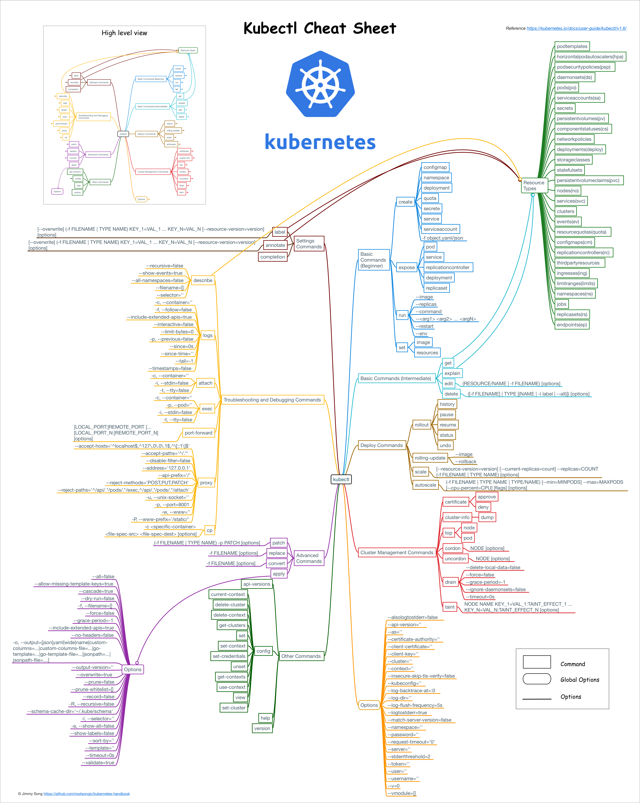
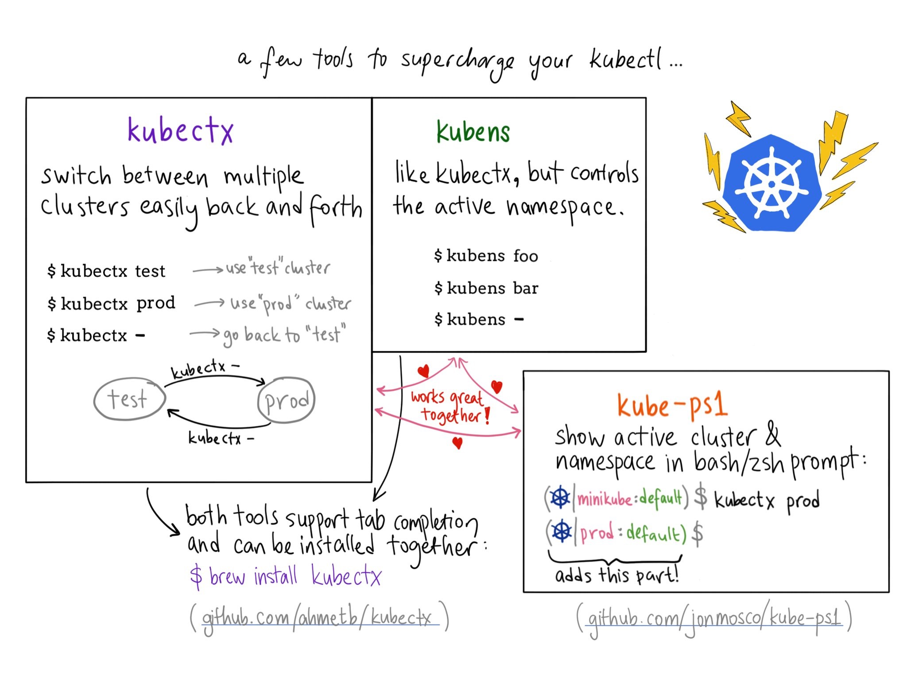
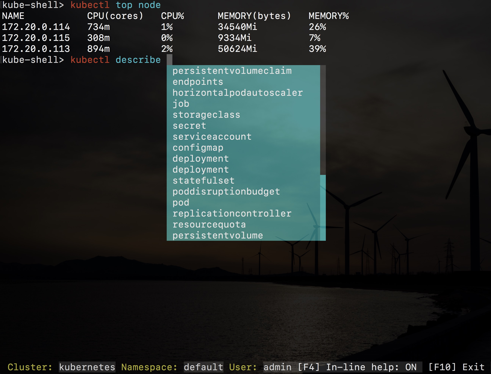

# Kubectl命令概览
> 1. Kubernetes提供的kubectl命令是与集群交互最直接的方式，v1.6版本的kubectl命令参考图如下：   

> 2. Kubectl的子命令主要分为8个类别：   
>> 1. 基础命令（初学者都会使用的）   
>> 2. 基础命令（中级）   
>> 3. 部署命令   
>> 4. 集群管理命令   
>> 5. 故障排查和调试命令   
>> 6. 高级命令   
>> 7. 设置命令   
>> 8. 其他命令   
> 3. 熟悉这些命令有助于大家来操作和管理kubernetes集群。

# 命令行提示
> 1. 为了使用kubectl命令更加高效，我们可以选择安装一下开源软件来增加操作kubectl命令的快捷方式，同时为kubectl命令增加命令提示。   

>> 1. [kubectx](https://github.com/ahmetb/kubectx)：用于切换kubernetes context   
>> 2. [kube-ps1](https://github.com/jonmosco/kube-ps1)：为命令行终端增加$PROMPT字段   
>> 3. [kube-shell](https://github.com/cloudnativelabs/kube-shell)：交互式带命令提示的kubectl终端   
>>
> 2. 全部配置完成后的kubectl终端如下图所示：   



## kube-shell
> 1. 开源项目kube-shell可以为kubectl提供自动的命令提示和补全，使用起来特别方便，推荐给大家。   
> 2. Kube-shell有以下特性：   
>> 1. 命令提示，给出命令的使用说明   
>> 2. 自动补全，列出可选命令并可以通过tab键自动补全，支持模糊搜索   
>> 3. 高亮   
>> 4. 使用tab键可以列出可选的对象   
>> 5. vim模式   
>>
> 3. centos下安装   
```bash
# yum install python34-pip
# pip3 install kube-shell
```

# kubectl的身份认证
> 1. Kubernetes中存在三种安全认证方式：   
>> 1. CA证书：API server与其它几个组件之间都是通过这种方式认证的   
>> 2. HTTP base：即在API server的启动参数中指定的--token-auth-file=/etc/kubernetes/token.csv文件中明文的用户、组、密码和UID配置   
>> 3. bearer token：HTTP请求中header中传递的Autorization:Bearer token，这个token通常保存在创建角色跟serviceaccount绑定的时候生成的secret中。   
>>
> 2. kubectl通过读取kubeconfig文件中的配置信息在向API server发送请求的时候同时传递认证信息，同时支持CA证书和bearer token的认证方式，请参考使用kubeconfig文件配置跨集群认证。

# 终端下kubectl命令自动补全
> 1. 建议使用[oh-my-zsh](https://ohmyz.sh/)，增加对kubectl命令自动补全支持。   
> 2. 修改~/.zshrc文件，增加如下两行：   
```bash
plugins=(kubectl)
source <(kubectl completion zsh)
```
> 3. 保存后重启终端即可生效。


